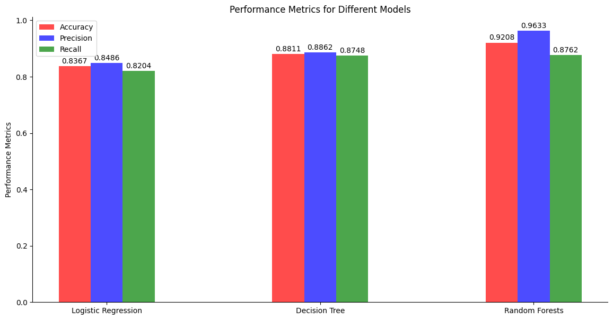
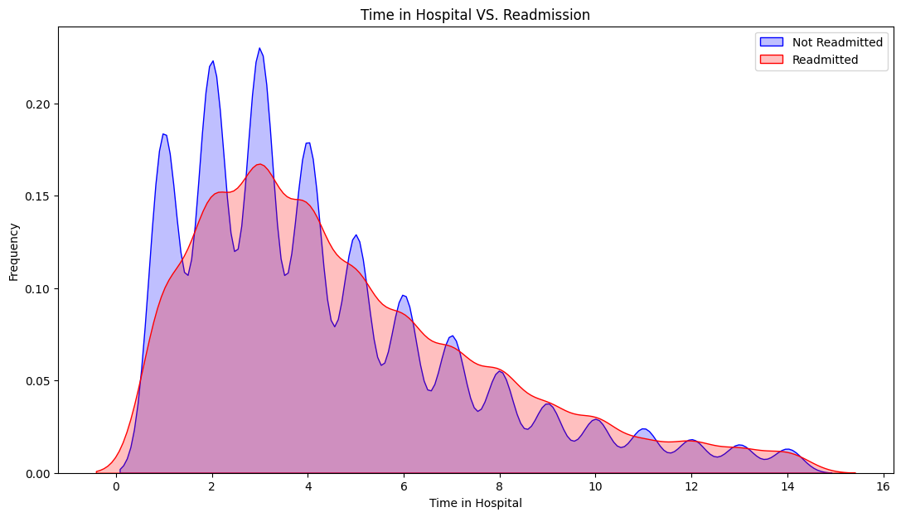
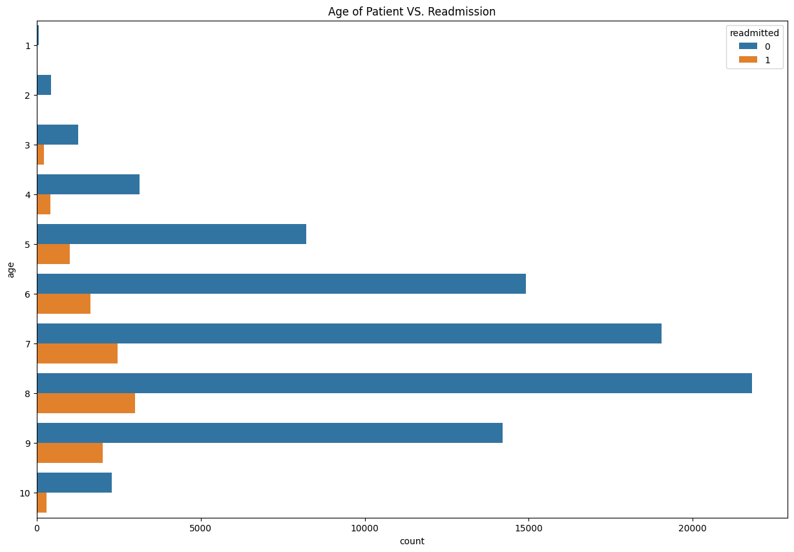
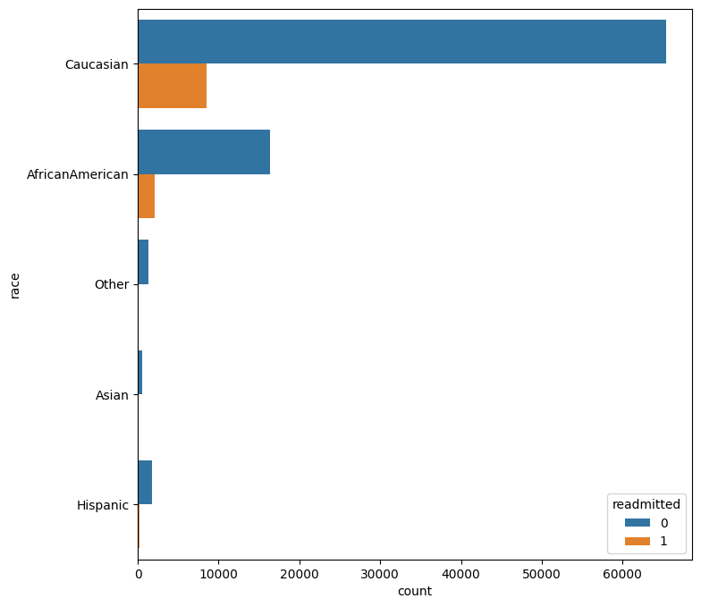
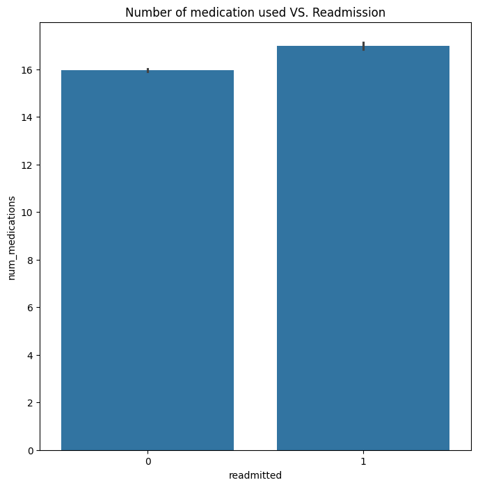
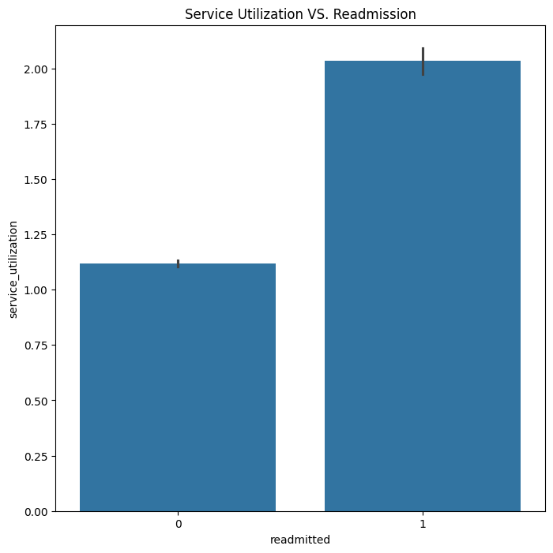
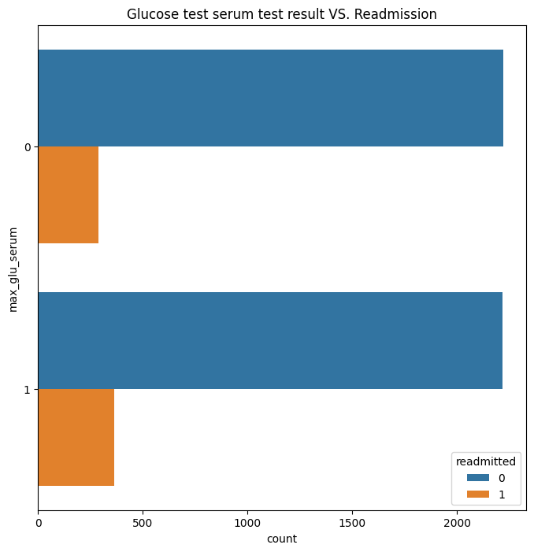
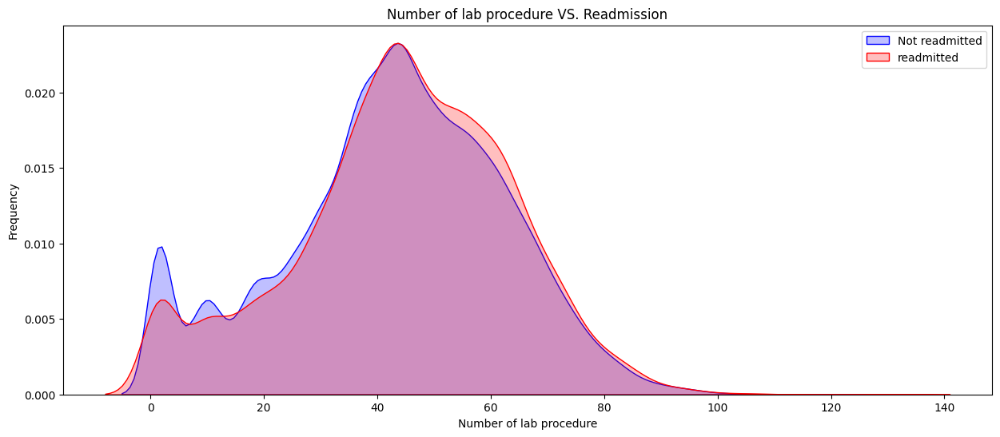
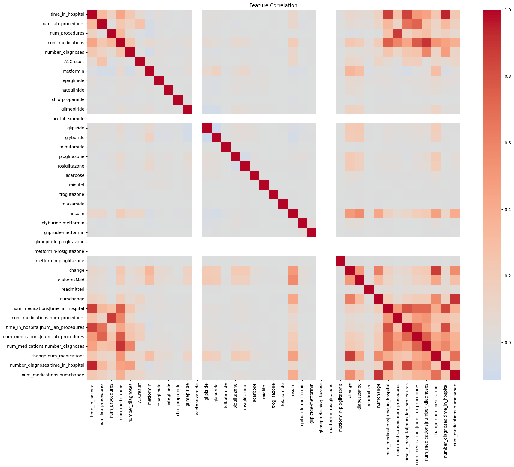

# Diabetes Patient Readmission Classification

Predict whether a diabetic patient will be **readmitted to hospital within 30 days**,
using the [Diabetes 130-US Hospitals (1999–2008)](https://archive.ics.uci.edu/dataset/296/diabetes+130-us+hospitals+for+years+1999-2008)
dataset (~100k encounters, 50 columns).

The project is an end-to-end ML pipeline: clean → feature-engineer → transform →
train three models → track them in **MLflow** → serve the winning model through a
**FastAPI** `POST /predict` endpoint.

---

## What it does

1. **Load & clean** the raw `diabetic_data.csv` — drop sparse columns
   (`weight`, `payer_code`, …), remove invalid rows (missing diagnoses/race,
   expired patients, unknown gender).
2. **Feature engineering** — service utilization, medication-change counts,
   ICD-9 diagnosis grouping, age midpoints, drug binary-encoding, and pairwise
   interaction terms.
3. **Transform** — skew reporting, z-score standardization + outlier removal,
   one-hot encoding → a 42-feature model matrix.
4. **Train** Logistic Regression (L1), Decision Tree, and Random Forest, each on
   SMOTE-balanced data.
5. **Track** every model's params, metrics, and artifact in MLflow.
6. **Serve** the Random Forest (the winner) via FastAPI.

### Model results

| Model | Accuracy | Precision | Recall | F1 |
|-------|---------:|----------:|-------:|---:|
| Logistic Regression | 0.837 | 0.849 | 0.820 | 0.834 |
| Decision Tree | 0.881 | 0.884 | 0.876 | 0.880 |
| **Random Forest (winner)** | **0.920** | **0.958** | **0.880** | **0.918** |

> Note: Decision Tree / Random Forest scores are high partly because SMOTE is
> applied before the train/test split (preserved from the original notebook).
> Numbers vary slightly per run.

---

## Generated artifacts

Running the pipeline writes plots to `outputs/`, the serving model to `models/`,
and tracking runs to `mlruns/`.

### Model comparison



### Exploratory data analysis

| | |
|---|---|
|  |  |
|  |  |
|  |  |
|  |  |

---

## Project structure

```
Diabetes-Patient-Readmission-Classification/
├── main.py                      # orchestrator: full pipeline end-to-end
├── pyproject.toml               # uv-managed dependencies
├── diabetic_data.csv            # raw dataset
├── src/
│   ├── config.py                # pydantic-validated settings + column lists
│   ├── logger.py                # central loguru logger
│   ├── data_loader.py           # CSV loading
│   ├── cleaning.py              # drop sparse cols / invalid rows
│   ├── feature_engineering.py   # derived features, encoding, interactions
│   ├── transform.py             # standardize, outlier removal, one-hot
│   ├── visualization.py         # EDA + model-comparison plots
│   ├── models.py                # SMOTE, train/eval LogReg/DTree/RF
│   ├── tracking.py              # MLflow experiment + run logging
│   ├── persistence.py           # save/load the winning model (joblib)
│   ├── schemas.py               # FastAPI request/response models
│   └── api.py                   # FastAPI /predict service
├── test/                        # ready-to-POST /predict payloads
├── outputs/                     # generated plots (created by main.py)
├── models/                      # winner_random_forest.joblib + sample_input.json
└── mlruns/                      # MLflow tracking store
```

---

## Setup

Requires [uv](https://docs.astral.sh/uv/). Install dependencies:

```bash
uv sync
```

> If `uv sync` fails on a `scipy` source build (no wheel for your Python), the
> dependencies are already resolvable in the existing `.venv`; prefix commands
> with `uv run --no-sync` to skip re-resolution, or loosen the exact version
> pins in `pyproject.toml` back to `>=` ranges.

---

## 1. Run the training pipeline

```bash
uv run python main.py
```

This trains all three models and produces:
- `outputs/*.png` — EDA plots + model comparison
- `models/winner_random_forest.joblib` — the served model + its feature columns
- `models/sample_input.json` — a ready `/predict` feature payload
- `mlruns/` — MLflow runs

---

## 2. MLflow — experiment tracking

Each run logs one MLflow run per model (params, metrics, model artifact) under the
`diabetes-readmission` experiment.

Launch the MLflow UI:

```bash
uv run mlflow ui          # then open http://127.0.0.1:5000
```

Inspect runs from the CLI:

```bash
uv run mlflow experiments search
uv run mlflow runs search --experiment-id <ID>
```

---

## 3. FastAPI — model serving

Start the API (needs `models/winner_random_forest.joblib` from step 1):

```bash
uv run uvicorn src.api:app --port 8000
```

Interactive docs: <http://127.0.0.1:8000/docs>

### Endpoints

| Method | Path | Description |
|--------|------|-------------|
| `GET`  | `/health`  | Service status + feature count |
| `POST` | `/predict` | Predict readmission from an engineered feature vector |

`POST /predict` accepts the **42 engineered feature values** (the exact model input)
and returns:

```json
{
  "prediction": 1,
  "label": "readmitted <30 days",
  "probability_readmit_lt30": 0.535
}
```

### Try it

```bash
# health
curl -s localhost:8000/health

# prediction using a generated payload
curl -s -X POST localhost:8000/predict \
  -H 'Content-Type: application/json' \
  -d @test/predict_readmitted.json
```

---

## 4. Test payloads

The `test/` directory holds ready-to-POST JSON payloads built from real data rows
(see `test/README.md`):

| File | Expected |
|------|----------|
| `predict_not_readmitted.json` | `200` → `prediction: 0` |
| `predict_readmitted.json` | `200` → `prediction: 1` |
| `invalid_missing_features.json` | `422` (missing features) |
| `invalid_empty.json` | `422` (empty features) |

Regenerate them anytime:

```bash
uv run python test/generate_payloads.py
```

---

## Tech stack

pandas · numpy · scikit-learn · imbalanced-learn (SMOTE) · scipy · matplotlib ·
seaborn · MLflow · FastAPI · uvicorn · pydantic · loguru · uv
